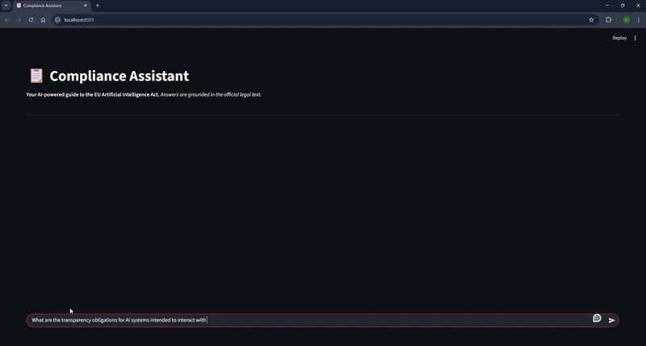

# Compliance Assistant

**A Retrieval-Augmented Generation (RAG) platform for navigating the EU Artificial Intelligence Act.**


> **The Problem:** Standard Large Language Models (LLMs) often hallucinate when asked about specific legal articles.
> **The Solution:** Compliance Assistant uses a **RAG Architecture** to ground every answer in the official legal text, providing precise citations and raw source evidence for verification.

---

## Demo

*(Note: If the GIF above doesn't load, please check the repo for `demo.gif`)*

---

## Technical Architecture

This project is not just a wrapper around an API; it is a modular, containerized application designed for scalability.

### 1. The RAG Pipeline
* **Ingestion:** A custom ingestion script (`scripts/ingest.py`) parses raw PDF documents using `PyMuPDF` to preserve layout structure.
* **Vector Store:** Text chunks are embedded and stored locally in **PostgreSQL** using the `pgvector` extension. This ensures data sovereignty (no sending sensitive documents to external vector clouds).
* **Retrieval:** The system uses `LlamaIndex` to perform semantic search, retrieving the top-k most relevant legal nodes before sending them to the LLM.

### 2. Modularity (Strategy Pattern)
The application handles compliance logic via a **Strategy Pattern**. The backend is regulation-agnostic.
* **Abstract Base Class:** `RegulationModule` defines the interface.
* **Concrete Implementation:** `EUAIActModule` implements the specific logic for the EU AI Act.
* *Scalability:* Adding GDPR or US Executive Order support only requires adding a new module file, not rewriting the engine.

### 3. Decoupled Architecture
* **Backend:** **FastAPI** serves the logic as a REST API. It handles the LLM interaction, database queries, and session management.
* **Frontend:** **Streamlit** consumes the API. This separation allows the backend to potentially serve other clients (e.g., a mobile app or Slack bot) in the future.

---

## Tech Stack

| Component | Technology | Reason |
| :--- | :--- | :--- |
| **LLM** | Google Gemini Pro | High context window and reasoning capabilities. |
| **Orchestration** | LlamaIndex | Robust framework for connecting data to LLMs. |
| **Vector DB** | PostgreSQL (`pgvector`) | Industry-standard relational DB extended for AI; simplifies infrastructure. |
| **Backend** | FastAPI | High-performance, async Python web framework. |
| **Frontend** | Streamlit | Rapid UI development for data applications. |
| **Infrastructure** | Docker Compose | One-command orchestration of the Database and App environment. |

---

## How to Run Locally

### Prerequisites
* Docker & Docker Compose
* Python 3.10+
* A Google Gemini API Key

### Step 1: Clone the Repository
```bash
git clone https://github.com/larissa-engelbrecht/compliance-assistant.git
cd compliance-assistant
```

### Step 2: Set Up Python Environment

Create and activate a virtual environment:
```bash
# Create virtual environment
python -m venv venv

# Activate virtual environment
# On macOS/Linux:
source venv/bin/activate
# On Windows:
venv\Scripts\activate
```

Install dependencies:
```bash
pip install -r requirements.txt
```

### Step 3: Configure Environment

Create a `.env` file in the root directory:
```ini
GOOGLE_API_KEY=your_gemini_api_key_here
API_URL=http://127.0.0.1:8000
DB_HOST=localhost
DB_NAME=vector_db
DB_USER=admin
DB_PASSWORD=password123
```

### Step 4: Start Infrastructure (Database)

Launch the PostgreSQL container with `pgvector` enabled:
```bash
docker-compose up -d
```

### Step 5: Ingest Data

Parse the provided EU AI Act PDF and populate the local vector database:
```bash
python scripts/ingest.py
```

*(This will read `data/EU_AI_Act.pdf` and create embeddings in Postgres)*

### Step 6: Run the Application

You will need two terminal windows (or run in background).

**Terminal 1 (Backend API):**
```bash
uvicorn app.main:app --reload
```

**Terminal 2 (Frontend UI):**
```bash
streamlit run app/frontend.py
```

Open your browser to [http://localhost:8501](http://localhost:8501).

---

## Future Roadmap (v2.0)

* **GraphRAG Implementation:** Move beyond semantic similarity to knowledge graphs, linking "Policies" directly to their required "Evidence" nodes.
* **Human-in-the-Loop Redlining:** An interface for compliance officers to edit and approve AI-generated audit responses.
* **Multi-Regulation Support:** Implementing the `GDPRModule` to demonstrate the Strategy Pattern in action.

---

## 📄 License

Distributed under the MIT License. See `LICENSE` for more information.
